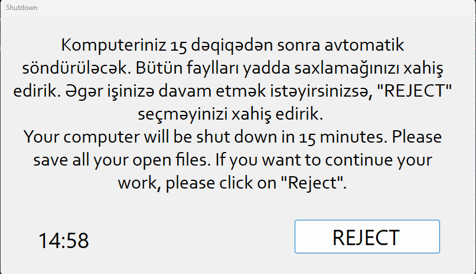

# Shutdown Warning App

A Windows desktop app that warns users of an idle computer with a **15-minute countdown** before automatically shutting it down. The user can cancel by clicking **REJECT**.

## Screenshot



## How it works

1. App launches and shows a warning dialog with a countdown timer
2. An alert sound plays immediately on launch
3. The timer counts down second by second
4. If the countdown reaches `00:00` the computer shuts down immediately
5. If the user clicks **REJECT** the dialog closes and shutdown is cancelled

## Requirements

- Windows 10 or 11
- .NET Framework 4.7.2 (included in Windows 10/11 by default)
- Visual Studio 2019 or later (to build from source)

## Running the app

### From Visual Studio
1. Open `Final_Project.sln`
2. Press **F5** (or **Ctrl+F5** to run without debugger)

### From command line
```
msbuild Final_Project.sln /p:Configuration=Release
bin\Release\Final_Project.exe
```

> **Warning:** Running the app starts a real shutdown countdown. Click REJECT during testing.

## Changing the countdown duration

Open `App.config` and edit the `CountdownMinutes` value:

```xml
<add key="CountdownMinutes" value="15" />
```

No recompile needed — the app reads this file at startup. Set it to any positive whole number (e.g. `10` for 10 minutes).

## Deployment

To run automatically on idle computers, schedule `Final_Project.exe` via:
- **Windows Task Scheduler** — trigger on idle or at a set time
- **Group Policy** — deploy to multiple machines on a domain

## Project structure

```
Final_Project/
├── Form1.cs                # Main logic: countdown, shutdown, reject
├── Form1.Designer.cs       # Auto-generated UI layout
├── Program.cs              # Entry point
├── livech.mp3              # Alert sound (embedded resource)
├── App.config              # Configurable settings (countdown duration)
└── Final_Project.csproj    # Project file
```

## Build notes

Assembly signing is disabled. The `.pfx` certificate files are excluded from the repo via `.gitignore`.
